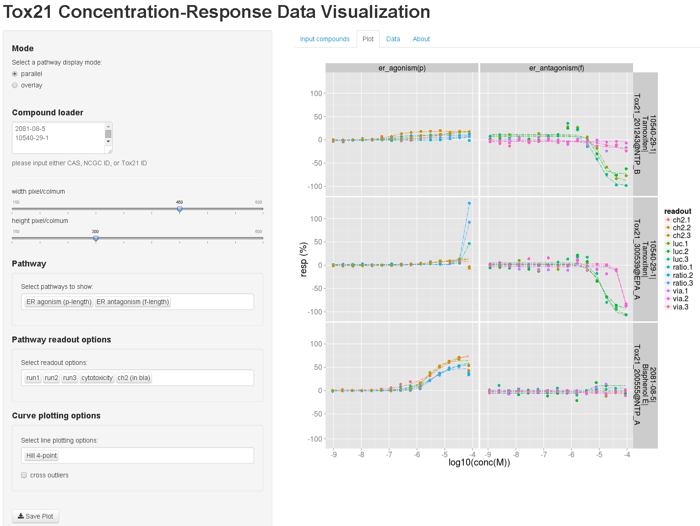

CurveVisualizationGUI4Tox21
===========================

A R Shiny interface to visualize the concentration-response data generated in Tox21 collaboration

Usage
-----

demo: [http://spark.rstudio.com/moggces/plotting/](http://spark.rstudio.com/moggces/plotting/)

or

- download the files in GitHub
- extract the zip file in a folder and make the folder as working directory 
- download the rda files in [Odum Institute Dataverse Network: http://arc.irss.unc.edu/dvn/dv/curvepwauc](http://arc.irss.unc.edu/dvn/dv/curvepwauc) 
- create the data folder under working director for the rda files
- library(shiny)
- runApp()
